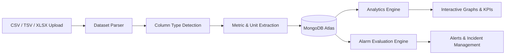
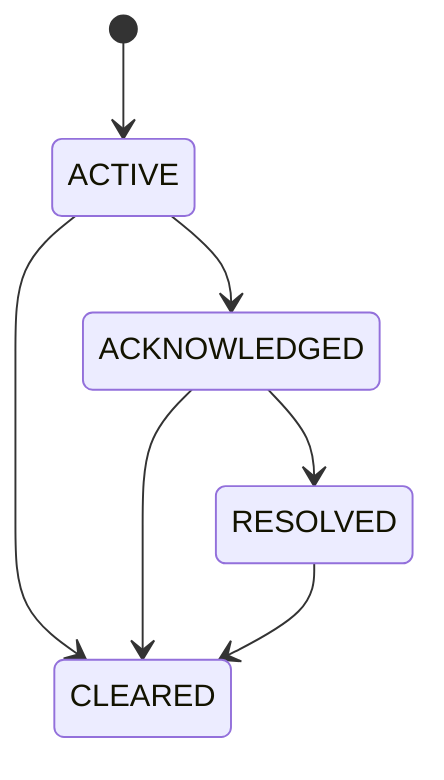

<div align="center">

# ⚡ Tata Power Jojobera
## Intelligent Operations Command Center

**A full-stack industrial telemetry monitoring, analytics and alarm management platform.**

[](https://tata-power-plant.vercel.app/)
[](https://react.dev/)
[](https://nodejs.org/)
[](https://www.mongodb.com/)
[](https://vercel.com/)

### 🚀 [View Live Demo](https://tata-power-plant.vercel.app/)

</div>

---

## 📌 Overview

**Tata Power Jojobera Intelligent Operations Command Center** is a production-oriented industrial monitoring platform designed to visualize telemetry data, analyze equipment performance, configure operational thresholds, and manage real-time alarms.

The system follows a strict **No Fake Data** approach — analytics, graphs, KPIs, equipment statistics, and alerts are generated from actual uploaded telemetry records.

---

## ✨ Key Features

### 📊 Dynamic Telemetry Analytics
- Upload **CSV, TSV and XLSX** datasets
- Automatic dataset parsing and column detection
- Automatic numeric metric discovery
- Dynamic graph generation based on uploaded data
- One metric / telemetry channel visualization
- Interactive charts with actual data tooltips
- Equipment-wise telemetry breakdown
- Latest, minimum, average and maximum readings
- Chart type controls such as Area, Line and Bar
- CSV and chart export support

### 🚨 Intelligent Alarm System
- Configure thresholds independently for each metric
- Low, Normal Min, Normal Max, Warning and Critical limits
- Custom metric creation
- Dataset-specific threshold configurations
- Automatic alarm evaluation from real telemetry records
- Severity classification
- ACTIVE, ACKNOWLEDGED, RESOLVED and CLEARED lifecycle states
- Single alert clearing
- Multi-select batch alert clearing
- Historical alarm filtering and audit support

### 🧠 Smart Data Processing
- Automatic column type inference
- Physical unit detection where available
- Date and time parsing
- Equipment / generator dimension extraction
- Dynamic metric discovery
- Real database-backed analytics
- Honest empty states when no valid telemetry is available

### 🛡️ Production Data Integrity
- MongoDB Atlas persistence
- Unique dataset identifiers
- Idempotent upload handling
- SHA-256 file hashing support
- Duplicate telemetry prevention
- Compound unique database indexes
- Deterministic record identifiers
- Global MongoDB `E11000` duplicate-key handling
- Persistent alarm lifecycle state
- Audit metadata for cleared alerts

### 👨‍💼 Admin & Operations
- Dataset management
- Metric management
- Custom metric creation
- Threshold configuration
- Alarm monitoring controls
- Alert management
- Activity logs
- Dashboard layout persistence
- Staff / access management interface
- System backup controls

---

## 🖥️ Application Modules

```text
🏠 Dashboard
   ├── Operational overview
   ├── KPIs
   └── Active system insights

📈 Analytics
   ├── Dynamic telemetry graphs
   ├── Equipment breakdown
   ├── Interactive data tooltips
   ├── 2D analytics
   └── 3D analytics

🚨 Alerts
   ├── Active alarms
   ├── Warning alerts
   ├── Critical alerts
   ├── Alarm lifecycle management
   └── Clear / batch clear actions

🗂️ Data Management
   ├── CSV upload
   ├── TSV upload
   ├── XLSX upload
   ├── Dataset storage
   └── Dynamic metric extraction

⚙️ Admin
   ├── Threshold configuration
   ├── Custom metrics
   ├── Users
   ├── Activity logs
   └── Settings
```

---

## 🛠️ Tech Stack

| Layer | Technologies |
|---|---|
| 🎨 Frontend | React, TypeScript, Modern UI Components |
| 📊 Visualization | Dynamic Chart System |
| ⚙️ Backend | Node.js, Express |
| 🗄️ Database | MongoDB Atlas |
| 🔐 Data Integrity | Unique Indexes, Idempotency, SHA-256 Hashing |
| 🚨 Alarm Engine | Real-time Threshold Evaluation |
| 📁 File Processing | CSV, TSV, XLSX Parsing |
| ☁️ Deployment | Vercel / Cloud Deployment |

---

## 🔄 Data Flow



---

## 🚨 Alarm Lifecycle



### Supported States

| Status | Description |
|---|---|
| 🔴 ACTIVE | Alarm is currently active |
| 🟠 ACKNOWLEDGED | Operator has acknowledged the alarm |
| 🟢 RESOLVED | Operational condition has been resolved |
| ⚪ CLEARED | Alert has been manually or system-cleared |

---

## 📂 Supported Dataset Formats

| Format | Support |
|---|---|
| `.csv` | ✅ |
| `.tsv` | ✅ |
| `.xlsx` | ✅ |

The platform automatically analyzes uploaded datasets to identify usable telemetry metrics and uses the stored records for analytics and alarm evaluation.

---

## 🗄️ Database Architecture

The application uses **MongoDB Atlas** for persistent cloud storage.

Core persisted entities include:

```text
📦 Datasets
📊 Telemetry Records
⚙️ Metric Configurations
🚨 Alarm Rules
🔔 Alarm Events
📜 Incident History
📝 Activity Audit Logs
🧩 Dashboard Layouts
🔑 Idempotency Records
```

### Environment Variables

Create a `.env` file:

```env
MONGODB_URI=your_mongodb_atlas_connection_string
MONGODB_DB_NAME=tata_power_jojobera
```

> ⚠️ Never commit real database credentials or secrets to GitHub.

---

## 🚀 Getting Started

### 1️⃣ Clone the Repository

```bash
git clone <your-repository-url>
cd <your-project-folder>
```

### 2️⃣ Install Dependencies

```bash
npm install
```

or

```bash
bun install
```

### 3️⃣ Configure Environment Variables

Create a `.env` file and add your MongoDB configuration.

```env
MONGODB_URI=your_mongodb_connection_string
MONGODB_DB_NAME=tata_power_jojobera
```

### 4️⃣ Run the Application

```bash
npm run dev
```

or, depending on your project configuration:

```bash
bun run dev
```

---

## 🏗️ Production Build

```bash
npm run build
npm run start
```

Make sure your deployment platform uses the correct build output and server entry point.

---

## 🌐 Live Application

<div align="center">

### ⚡ [Open Tata Power Jojobera Command Center](https://tata-power-plant.vercel.app/)

</div>

---

## 🎯 Core Design Principle

> **No Fake Data. No Static Analytics.**

Every supported operational visualization should be derived from uploaded and persisted telemetry records. If valid data is unavailable, the system should display an honest empty state instead of generating synthetic readings.

---

## 🔮 Future Improvements

- [ ] WebSocket-based live telemetry streaming
- [ ] Role-based authentication
- [ ] Email and SMS alarm notifications
- [ ] Predictive maintenance using machine learning
- [ ] Advanced anomaly detection
- [ ] SCADA / IoT integration
- [ ] Scheduled automated reports
- [ ] Multi-plant monitoring
- [ ] Mobile operations dashboard

---

## 📸 Screenshots

> Add screenshots here to showcase the Dashboard, Analytics, Alarm Center and Admin Configuration.

```text
screenshots/
├── dashboard.png
├── analytics.png
├── alerts.png
├── threshold-config.png
└── admin-panel.png
```

---

## 🤝 Contributing

Contributions, suggestions and improvements are welcome.

1. Fork the project
2. Create a feature branch
3. Commit your changes
4. Push the branch
5. Open a Pull Request

---

<div align="center">

### ⚡ Built for Industrial Intelligence & Operational Visibility

**Tata Power Jojobera Intelligent Operations Command Center**

Made with ❤️ using React, Node.js and MongoDB

</div>
